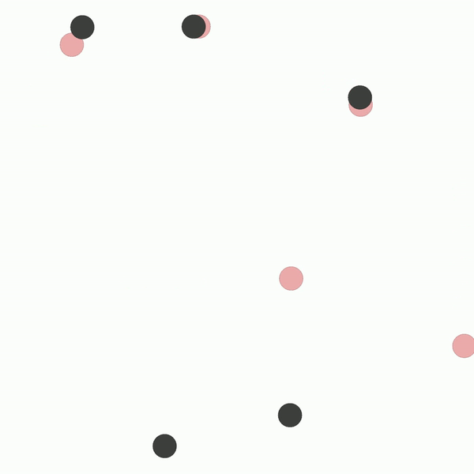

# ELIGN: Expectation Alignment as a Multi-agent Intrinsic Reward

This repository contains code to train and evaluate multiple agents with and without 
the alignment intrinsic reward in both the multi-agent particle (MAP) and Google research 
football (Gfootball) environments.

## Abstract

Modern multi-agent reinforcement learning frameworks rely on centralized training and reward shaping to perform well.
However, centralized training and dense rewards are not readily available in the real world. 
Current multi-agent algorithms struggle to learn in the alternative setup of decentralized training or sparse rewards.
To address these issues, we propose a self-supervised intrinsic reward ELIGN - expectation alignment - inspired by the self-organization principle in Zoology.
Similar to how animals collaborate in a decentralized manner with those in their vicinity, agents trained with expectation alignment learn behaviors that match their neighbors' expectations.
This allows the agents to learn collaborative behaviors without any external reward or centralized training.
We demonstrate the efficacy of our approach across 6 tasks in the multi-agent particle and the complex Google Research football environments, comparing ELIGN to sparse and curiosity-based intrinsic rewards.
When the number of agents increases, ELIGN scales well in all multi-agent tasks except for one where agents have different capabilities.
We show that agent coordination improves through expectation alignment because agents learn to divide tasks amongst themselves, break coordination symmetries, and confuse adversaries.
These results identify tasks where expectation alignment is a more useful strategy than curiosity-driven exploration for multi-agent coordination, enabling agents to do zero-shot coordination.

## Alignment illustraion

|  |
|:--:|

## Contents
- [Installation](#installation)
- [Training and evaluation](#training-and-evaluation)
- [Visualization](#visualization)

## Installation

### MAP

You will need the following dependencies to run experiments in the MAP environment. 
- python>=3.7
- pytorch>=1.7.1/1.7.1+cu110 (replace with your cuda version if applicable)
- gym>=0.17.2
- tensorboard (for logging)
- wandb (for logging)
- opencv (for visualization)
- tqdm (for progress checking)

### Gfootball

To run experiments in the Google football environment, please refer to [here](https://github.com/google-research/football) for installation requirements. 
The original football environment assumes full observability. Since our method mainly targets partially observable environments, please make sure to use ```football/gfootball/env``` in this repo when applying ELIGN.

## Training and evaluation

### MAP

You can simply train and evaluate agents with `map/train_multi_sacd.py` and `map/evaluate_multi_sacd.py` respectively. Below are two examples for training and evaluation:

```
python train_multi_sacd.py --task simple_spread_in --num-good-agents 5 --obs-radius 0.5 --intr-rew elign_team --epoch 5 --save-models --benchmark  --logdir log/simple_spread
```

```
python evaluate_multi_sacd.py --savedir result --logdir log/simple_spread
```

### Gfootball

To train and evaluate agents in Academy 3vs1 with keeper task in the Google Research football environment, run the following code under the ```gfootball/``` directory:

```
python run_multiagent_sac.py --name scoring_elign_adv_5M --align-mode elign_adv --radius 0.5 --num-iters 50000
```

## Visualization

You can use the following command to visualize the policies learned by the agents in the multi-agent particle environment.

```
python visualize_multi_sacd.py --benchmark --save-video --logdir log/simple_spread
```

Below is an example of the emerged behaviors with and without the alignment intrinsic reward in the Cooperative navigation (5v0) task.
agents cluster with sparse reward only | agents spread out with alignment reward
-----------------------|-----------------------|
| 

