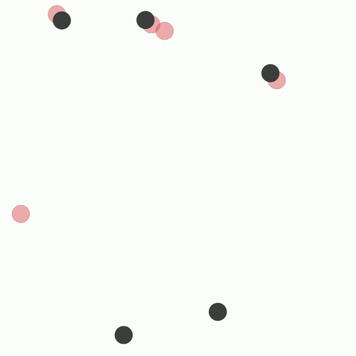

# Alignment as a Multi-agent Intrinsic Reward

This repository contains code to train and evaluate multiple agents with and without 
the alignment intrinsic reward in both the multi-agent particle (MAP) and Google research 
football (Gfootball) environments.

[[Paper]]()

## Abstract

Modern multi-agent reinforcement learning frameworks rely on centralized training and reward shaping to perform well.
However, centralized training and dense rewards are not readily available in the real world. 
Current multi-agent algorithms struggle to learn in the alternative setup of decentralized training or sparse rewards.
To address these issues, we propose a self-supervised intrinsic reward called alignment inspired by the self-organization principle in Zoology.
Similar to how animals collaborate in a decentralized manner with those in their vicinity, agents trained with alignment learn behaviors that match their neighbors' expectations.
This allows the agents to learn collaborative behaviors without any external reward or centralized training.
We demonstrate the efficacy of our approach across 6 tasks in the multi-agent particle and the complex Google Research football environments, comparing alignment to sparse and curiosity-based intrinsic rewards.
When the number of agents increases, alignment scales well in all multi-agent tasks except for one where agents have different capabilities.
We show that agent coordination improves through alignment because agents learn to divide tasks amongst themselves, break coordination symmetries, and confuse adversaries.
These results identify tasks where alignment is a more useful strategy than curiosity-driven exploration for multi-agent coordination, enabling agents to do zero-shot coordination.

## Alignment illustraion

|  |
|:--:|

## Contents
- [Installation](#installation)
- [MAP](#map)
- [Gfootball](#gfootball)

## Installation

### MAP

Please install the `tianshou` package according to the instructions [here](https://github.com/thu-ml/tianshou#installation). 

Additionally, we have provided an conda environment yaml file ```map/marl.yml```, and you can install the conda environment with ```conda env create -f marl.yml``` after changing the ```prefix``` in the file to be your directory.

### Gfootball

Please install the `gfootball` environment according to the instructions [here](https://github.com/google-research/football). 

Since the original google football environment assumes full observability, there is an additional step for running experiments under partial observability. Please replace your installed ```your_installation_directory/gfootball/env``` with the ```football/gfootball/env``` in this repo.

## MAP

Each experiment consists of training agents and evaluating their performance in one task with a particular random seed. 
If you want to run multiple experiments with different random seeds, use the code example below under the ```map/``` directory:

```
python run_experiments.py --task simple_tag --test  --test-amb-init  --num-good-agents 4 --num-adversaries 4 --epoch 200 --date 0525 --obs-radius 0.5 --curiosity --seeds 42 43 44
```
Alternatively, you can also separately train or evaluate agents in one experiment following the code examples below:

### Training

```
python train_multi_sacd.py --task simple_spread_in --save-models --benchmark --device cuda --rew-norm 1 --buffer-size 2000000 --wandb-enabled 1 --epoch 100 --num-good-agents 5 --obs-radius 0.5 --intr-rew 101 --logdir /scr/zixianma/multiagent/simple_spread
```

### Evaluation

```
python evaluate_multi_sacd.py --savedir result --amb-init 1 --logdir /scr/zixianma/multiagent/simple_spread
```

## Gfootball

To train and evaluate agents in Academy 3vs1 with keeper task in the Google Research football environment, run the following code under the ```gfootball/``` directory:

```
python run_multiagent_sac.py --name scoring_align_110_5M --seeds 3 --radius 0.5 --align-mode 110 --num-iters 50000 --num-gpus 1
```

## Visualization
Below is an example of the emerged behaviors with and without the alignment intrinsic reward in the Cooperative navigation (5v0) task.
agents cluster with sparse reward only | agents spread out with alignment reward
-----------------------|-----------------------|
| 

